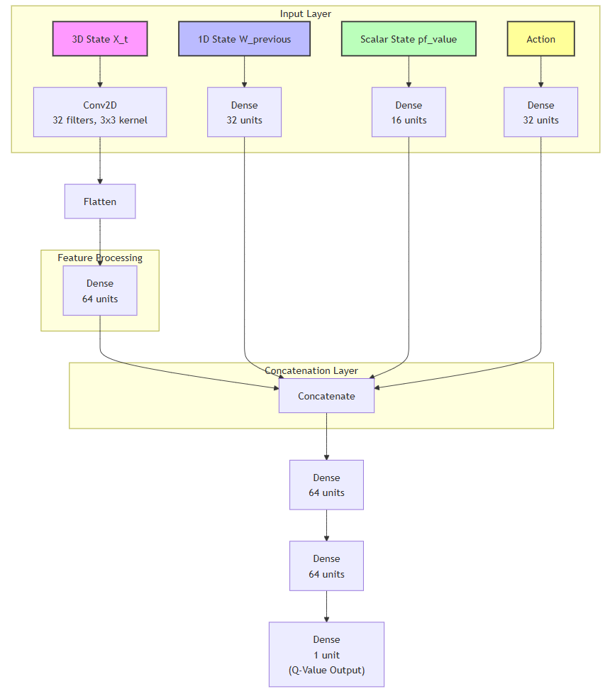
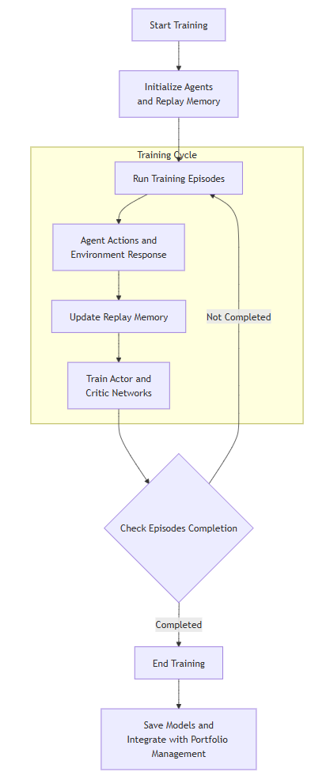

## Multi-Agent Reinforcement Learning (MARL) Framework

The **Multi-Agent Reinforcement Learning (MARL) framework** introduces an innovative reinforcement learning (RL)-based framework for dynamic portfolio optimization in quantitative finance, overcoming the limitations of traditional methods like **Mean-Variance Optimization (MVO)** and predictive machine learning models.

### Key Features:

- Neural network-based actor-critic architectures dynamically allocate portfolio weights.
- Learns from both historical and real-time market data.
- RL agent interacts with a simulated financial environment to:
  - Process multi-dimensional inputs.
  - Optimize performance through a risk-sensitive reward mechanism.

### Network Architectures:

#### Policy Network:

#### Critic Network:

#### Agent Training Lifecycle

### Innovations:

1. **State Representations**:
   - Integrates technical indicators and price trends.
2. **Action Spaces**:
   - Facilitates dynamic weight adjustments.
3. **Reward Functions**:
   - Balances returns with risk metrics.

### Experimental Results:

- **Datasets Evaluated**:
  - SP 500, Nasdaq, Dow Jones Industrial Average, and cryptocurrency markets.
- **Performance Achievements**:
  - 25.7% increase in cumulative returns.
  - Sharpe ratio: 1.45.
  - 15% reduction in portfolio volatility.
- Outperforms benchmarks like **Proximal Policy Optimization (PPO)**.

### Comparison of Results:

#### Table 1: Comparison of results on S&P500 Index, Bitcoin, Ethereum, and DowJones Industrial Average

| Algorithm | Sharpe Ratio | Maximum Drawdown | Return |
| --------- | ------------ | ---------------- | ------ |
| MARL      | 1.1          | 530              | 40%    |
| PPO       | 0.8          | 550              | 27%    |
| MVO       | 0.5          | 990              | 24%    |
| DQN       | 0.6          | 590              | 19.5%  |

#### Table 2: Comparison of results on different models in Nifty50 dataset

| Algorithm | Sharpe Ratio | Maximum Drawdown | Return |
| --------- | ------------ | ---------------- | ------ |
| MARL      | 0.95         | 502              | 39%    |
| PPO       | 0.9          | 460              | 40%    |
| MVO       | 0.6          | 650              | 35%    |
| DQN       | 0.5          | 1015             | 13%    |

### Scalability & Future Directions:

- Adaptability across asset classes.
- Resilience in volatile markets via robust learning algorithms.
- **Future Research Focus**:
  - High-frequency trading.
  - Incorporation of alternative data sources.
  - Enhancing explainability.

This study highlights the potential of RL to transform portfolio management by combining adaptability, scalability, and efficiency. It marks a significant advancement in data-driven financial optimization.
